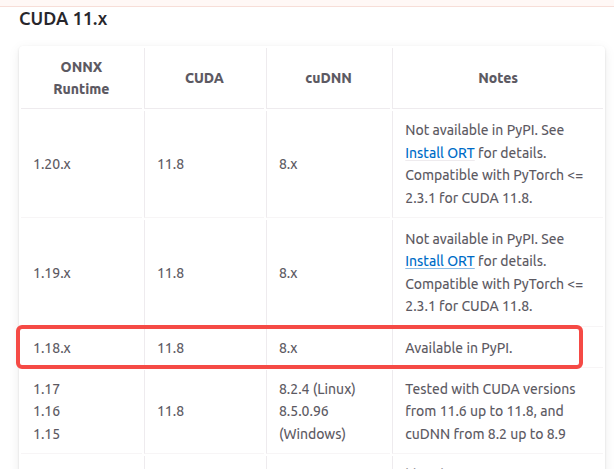

# segmentation by opencv-dnn or onnx-runtime

本仓库演示同一个 YOLO11 实例分割 ONNX 模型，分别用 OpenCV 5 DNN 和 ONNX Runtime 的 Python / C++ 入口做推理实现以及比较

## 目录

- `assets/segmentation.onnx`：示例模型
- `assets/input.png`：示例图片
- `main_opencv.py` / `main_opencv.cpp`：OpenCV DNN
- `main_ort.py` / `main_ort.cpp`：ONNX Runtime
- `shell/`：安装和运行脚本

## 环境

推荐环境：

- `conda` 环境：`opencv5`
- GPU 方案：`onnxruntime-gpu==1.17.3`，对应 `CUDA 11.8` / `cuDNN 8.x`
  - CUDA：`11.8`
  - cuDNN：`8.9.7.29`

如果 `build/` 已经存在，重新编译前请先重新执行 `cmake .. -DCMAKE_BUILD_TYPE=Release`


## 环境准备

### 安装python库


**onnx runtime**库与**cuda**版本对应关系，请访问 [onnx_runtime](https://onnxruntime.ai/docs/execution-providers/CUDA-ExecutionProvider.html#cuda-11x)

```shell
conda create -n opencv5 python=3.10
conda activate opencv5
cd shell
bash build_opencv5_python.sh        #opencv-python

pip install onnxruntime             #cpu版本
pip install onnxruntime-gpu==1.18.1 #gpu版本
```

### 安装c++库

```shell
cd shell
bash build_opencv5_cpp.sh   #opencv-c++
bash install_cuda.sh        #cuda
bash install_onnxruntime.sh #onnxruntime
```

---


# 编译

```shell
mkdir -p build && cd build
cmake .. -DCMAKE_BUILD_TYPE=Release
make -j$(nproc)
```

---


## OpenCV 5

Python 入口请始终在 `conda activate opencv5` 之后运行，确保使用仓库编译进该环境的 OpenCV 5.0 绑定

### Python

```bash
conda activate opencv5
python main_opencv.py assets/segmentation.onnx assets/input.png False 0.45 0.45
```

运行后结果保存在 `build/result_opencv_dnn_python_cpu.png`

### C++

```bash
cd build
./opencv_inference_cpu ../assets/segmentation.onnx ../assets/input.png false 0.45 0.45
```

运行后结果保存在 `build/result_opencv_dnn_cpp_cpu.png`

---

## ONNX Runtime Python

同样请在 `conda activate opencv5` 后运行 Python 入口，避免误用系统 Python

### CPU

```bash
conda activate opencv5
python main_ort.py assets/segmentation.onnx assets/input.png False 0.45 0.45 cpu
```

运行后结果保存在 `build/result_onnxruntime_python_cpu.png`


### GPU

```bash
conda activate opencv5
python main_ort.py assets/segmentation.onnx assets/input.png False 0.45 0.45 cuda
```

运行后结果保存在 `build/result_onnxruntime_python_cuda.png`

---

## ONNX Runtime C++

### CPU

```bash
./onnxruntime_inference_cpu ../assets/segmentation.onnx ../assets/input.png false 0.45 0.45 cpu
```

运行后结果保存在 `build/result_onnxruntime_cpp_cpu.png`

### GPU

```bash
./onnxruntime_inference_cuda ../assets/segmentation.onnx ../assets/input.png false 0.45 0.45 cuda
```

运行后结果保存在 `build/result_onnxruntime_cpp_cuda.png`

---

## 耗时对比

以下数据来自仓库示例图像 `assets/input.png` 和模型 `assets/segmentation.onnx`，仅用于横向对比

### CPU
- Intel® Core™ i7-10700 CPU @ 2.90GHz × 16

| 后端 | 语言 | Provider | 纯推理 ms | 全流程 ms |                                                                                               命令 |
| --- | --- | --- | ---: | ---: |-------------------------------------------------------------------------------------------------:|
| OpenCV 5 DNN | Python | CPU | 83.05 | 203.48 |                  python main_opencv.py assets/segmentation.onnx assets/input.png False 0.45 0.45 |
| OpenCV 5 DNN | C++ | CPU | 83.32 | 193.07 |           ./opencv_inference_cpu ../assets/segmentation.onnx ../assets/input.png false 0.45 0.45 |
| ONNX Runtime | Python | CPU | 107.59 |    160.00 |                 python main_ort.py assets/segmentation.onnx assets/input.png False 0.45 0.45 cpu |
| ONNX Runtime | C++ | CPU |    326.18 | 364.05 | ./onnxruntime_inference_cpu ../assets/segmentation.onnx ../assets/input.png false 0.45 0.45 cpu  |

### CUDA
- NVIDIA GeForce RTX 2060/PCIe/SSE2

| 后端 | 语言 | Provider | 纯推理 ms | 全流程 ms |                                                                                                 命令 |
| --- | --- | --- | ---: | ---: |---------------------------------------------------------------------------------------------------:|
| ONNX Runtime | Python | CUDA | 10.54 | 49.83 |                  python main_ort.py assets/segmentation.onnx assets/input.png False 0.45 0.45 cuda |
| ONNX Runtime | C++ | CUDA | 10.45 | 20.08 | ./onnxruntime_inference_cuda ../assets/segmentation.onnx ../assets/input.png false 0.45 0.45 cuda  |
